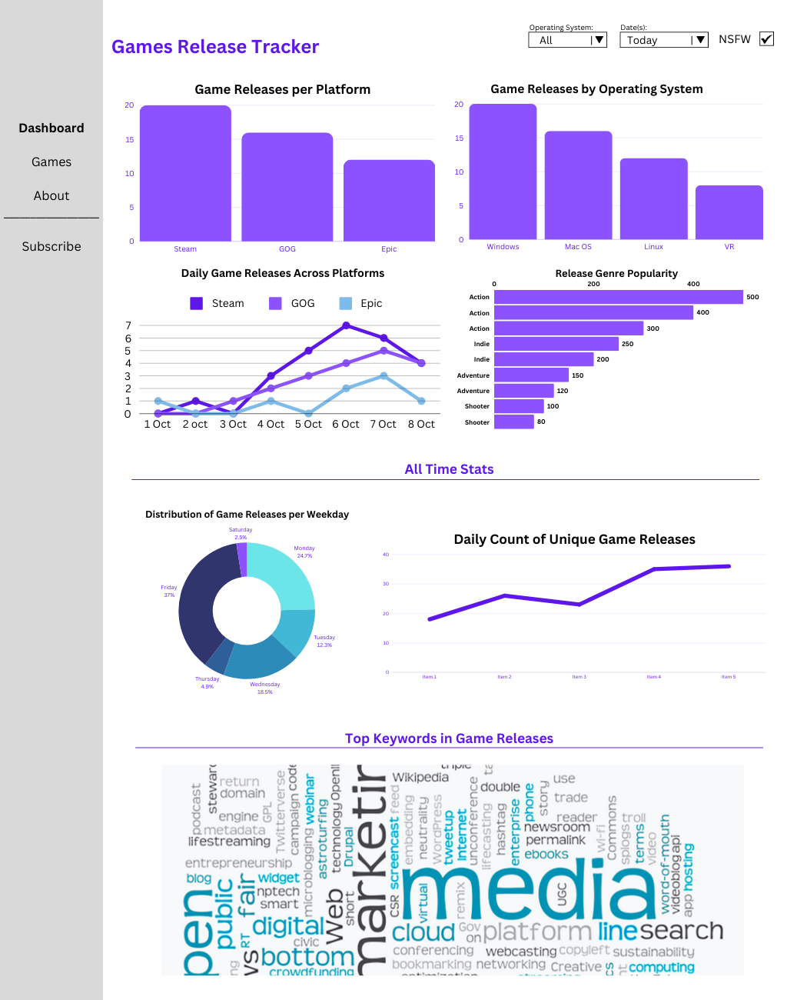
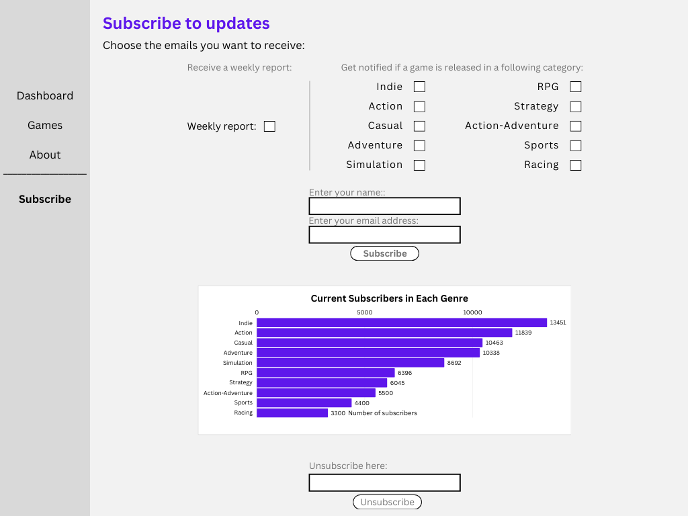

# Games Tracker Dashboard

This dashboard is designed to provide visualisations and insights into game releases from popular platforms such as Steam, GOG, and Epic Games. Users can track game releases, subscribe to updates, and explore trends based on operating systems, genres, and more.

The dashboard is geared toward:

- **Game enthusiasts**, who can use it to have all PC game releases in one place and track new releases easily.
- **Industry professionals**, who can use the insights for analysing trends and understanding the gaming market.

The dashboard is built using Streamlit, allowing for interactive and responsive visualisations that help users explore trends across platforms.

## Features

- Visualise game releases across platforms with customizable filters.
- Subscribe to weekly reports and genre-specific game updates via email.
- Explore genre popularity, operating system trends, and more.

## Wireframe

1. **Dashboard** (graphs that will be customised depending on user filters)



2. **About** (information about the project and dashboard)


3. **Games** (list of games with search functionality)


4. **Subscribe** (options to subscribe to relevant emails)



## Installation and Setup

### Repository Structure

The application files are structured as follows:

- `Dashboard.py`: The main Streamlit dashboard file that displays the graphs and insights.
- `sl_queries.py`: Contains SQL query functions to retrieve data from the RDS instance.
- `functions.py`: Functions for creating charts and preprocessing data.
- `test_dashboard.py`: For testing the dashboard functionalities.
- `pages/`: Contains additional pages for the dashboard.
    - `About.py`: Information about the Games Tracker project.
    - `Games.py`: Displays a searchable table of games.
    - `Subscribe.py`: Subscription page to manage user notifications.
    - `pages/utils/subscribe_functions.py`: Utility functions for subscribing/unsubscribing users.

### Environment Variables

Ensure the following environment variables are defined in your .env file:
```
DB_HOST=<Your RDS host>
DB_PORT=<Your RDS port>
DB_USER=<Your database user>
DB_PASSWORD=<Your database password>
DB_NAME=<Your database name>
REGION=<Your AWS region>
AWS_ACCESS_KEY=<Your AWS access key>
AWS_SECRET_KEY=<Your AWS secret key>
```

### Installing Dependencies

To set up the project:

1. Create a virtual environment:
 ```   
python -m venv .venv
source .venv/bin/activate  # For Linux/MacOS
.venv\Scripts\activate     # For Windows
``` 

2. Install the required dependencies:
```
pip install -r requirements.txt
```

### Running the Application

Run the Streamlit dashboard with:
```
streamlit run Dashboard.py
```

### Docker Setup and Deployment

Build, tag, push, and deploy your Dockerised dashboard on AWS:

1. Dockerfile

Ensure the repository contains a Dockerfile that defines how to build the application image.
2. Build the Docker image with platform
```
docker build --platform linux/amd64 -t games-tracker-dashboard .
```
3. Tag the image
```
docker tag games-tracker-dashboard:latest <aws-account-id>.dkr.ecr.<region>.amazonaws.com/<repository-name>:latest
```
4. Login to ECR
```
aws ecr get-login-password --region <region> | docker login --username AWS --password-stdin <aws-account-id>.dkr.ecr.<region>.amazonaws.com
```
5. Push the image to ECR
```
docker push <aws-account-id>.dkr.ecr.<region>.amazonaws.com/<repository-name>:latest
```
6. (Optional) Run the Docker Container Locally
```
docker run -p 8501:8501 games-tracker-dashboard
```

## Customisation

You can adjust the dashboard by:

- Modifying queries in `sl_queries.py` to fetch different game release data.
- Customizing charts in `functions.py` to display additional insights or change layouts.

## Ensure Consistency with AWS Configuration
Before running the dashboard, ensure that all AWS-related configurations in the repository match your AWS setup. This includes SNS topic names, RDS credentials, and any other AWS resources used within the application.

- SNS Topics: Confirm that the topic names specified in the code match the SNS topics you've created in your AWS account.
- RDS Configuration: Double-check that the database host, user, and password are consistent with your RDS setup.
- AWS Credentials: Verify that your AWS access keys, region, and any other environment variables are correctly defined in the .env file.

This will ensure smooth deployment and operation of the dashboard on AWS.